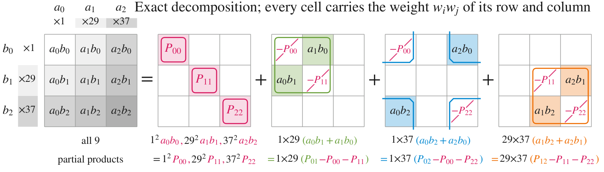

# FP4 BLAS

Exact integer matrix products on FP4 Tensor Cores, and the BLAS routines built on them.

> [!WARNING]
> Only GEMM is published so far, and the optimized implementations are not published yet. The code here is the working reference.

Adaptive Weight Encoding (AWE) splits an integer into limbs taken from the set of values FP4 can
store, with freely chosen integer weights, and multiplies linear combinations of limbs. The exact
product needs fewer FP4 GEMMs than the base-13 split of prior work. [`AWE/Solutions/`](AWE/Solutions/) is the
catalog of these encodings. Details are in the paper, [arXiv:2609.24519](https://arxiv.org/abs/2609.24519).

<table>
  <thead>
    <tr><th rowspan="2">Family</th><th rowspan="2">Inputs</th><th colspan="2">FP4 GEMMs for one exact product</th><th rowspan="2">Ratio</th></tr>
    <tr><th>Base-13 limbs<br>(prior work)</th><th>AWE</th></tr>
  </thead>
  <tbody>
    <tr><td rowspan="3">Direct</td><td>INT8 × INT8</td><td align="center">9</td><td align="center">6</td><td align="center">1.5×</td></tr>
    <tr><td>INT4 × INT8</td><td align="center">6</td><td align="center">4</td><td align="center">1.5×</td></tr>
    <tr><td>FP16 significand</td><td align="center">16</td><td align="center">12</td><td align="center">1.3×</td></tr>
    <tr><td>Residue systems<br>(K = 16,384)</td><td>FP64 significand</td><td align="center">75</td><td align="center">59</td><td align="center">1.3×</td></tr>
  </tbody>
</table>

The radix-13 limb representation itself is published in
[FP4-is-All-you-Need/Oz-FP4](https://github.com/FP4-is-All-you-Need/Oz-FP4).



The paper's example of INT8 × INT8 in 6 FP4 GEMMs, limb weights (1, 29, 37). The INT8 path of the
GEMM library uses the catalog solution with weights (1, 5, 27).

## Repository Structure

| Path | Content |
|---|---|
| [`AWE/Solutions/`](AWE/Solutions/) | Encoding solutions as data, one JSON line per solution. |
| [`AWE/CodeGen/`](AWE/CodeGen/) | The generator that turns a solution into C constants. |
| [`Platforms/NVIDIA/CUDA/GEMM/`](Platforms/NVIDIA/CUDA/GEMM/) | GEMM library: INT8 (AWE and radix-13), FP64 (residue systems) and complex FP64 backends, with examples and tests. |

## License

MIT; see [LICENSE](LICENSE).

## Citation

```bibtex
@misc{hayashi2026awe,
  title         = {AWE: Adaptive Weight Encoding for Exact Integer Matrix Products with Fewer GEMMs on FP4 Tensor Cores},
  author        = {Hayashi, Shun{-}ichiro and Mukunoki, Daichi and Hoshino, Tetsuya and Katagiri, Takahiro},
  year          = {2026},
  eprint        = {2609.24519},
  archivePrefix = {arXiv},
  primaryClass  = {cs.MS},
  url           = {https://arxiv.org/abs/2609.24519}
}
```
